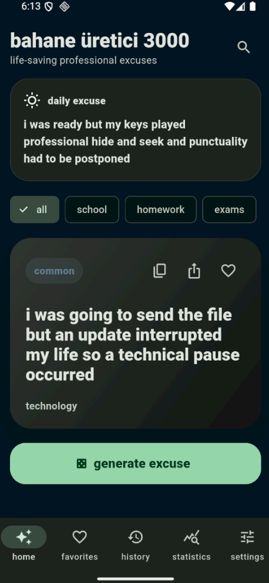
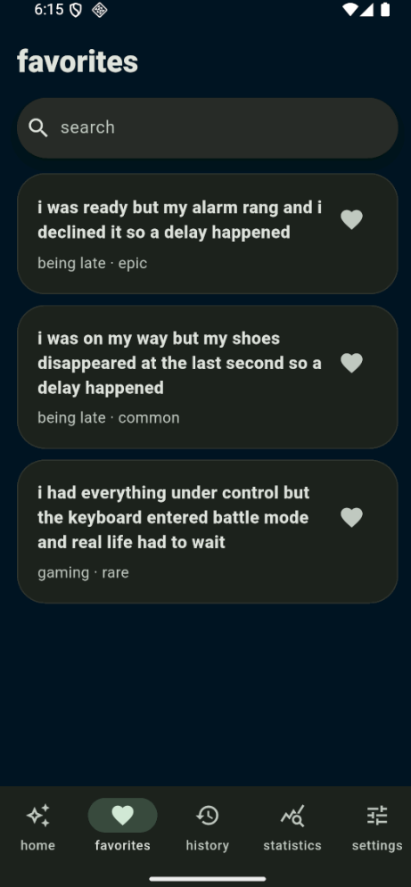
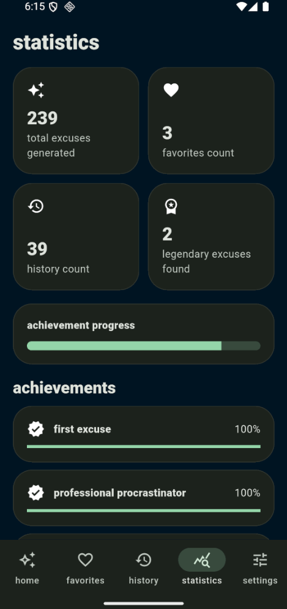

# bahane üretici 3000

offline flutter android (and ios coming soon) app for generating excuses in turkish and english.

## build

```bash
flutter pub get
flutter build apk --release
```

the release apk will be created under:

```text
build/app/outputs/flutter-apk/app-release.apk
```

## screenshots

<p align="center">
  
  
  
</p>

## ios

ios builds must be made on macos with xcode installed.
(warning, probably has lots of bugs, not sure if it`ll work.)

```bash
flutter pub get
flutter build ios --release
```

to run in the ios simulator on macos:

```bash
open -a Simulator
flutter run
```

## notes

- no login, ads, tracking, subscriptions, or internet access are required.
- language and theme can be selected during onboarding and changed instantly in settings.
- all app data is stored locally with shared preferences.
